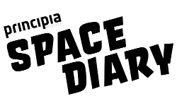

## Introduction

There are over half a million pieces of space junk orbiting the Earth. Some of these travel at speeds of up to 175,000 miles per hour. This makes it tricky to get a spacecraft from Earth to the International Space Station and back again.

In this activity, you're going to build a Space Maze through which the pilot of a spacecraft has to carefully navigate to get back down to Earth from the ISS.

On 15 December 2015, British ESA astronaut Tim Peake set off on the Principia mission to the International Space Station, which is in orbit around the Earth. This project ties in with the Principia Space Diary, a free resource for UK schools, which was produced as part of Tim Peake’s Principia Mission. For more information about the Space Diary, visit [principiaspacediary.org](http://principiaspacediary.org).

### What you will learn

By following the Space Maze project guide you will learn:

- How to use the pen tool in Scratch
- How to use basic loops and conditionals in Scratch
- How to detect collisions in Scratch

This resource covers elements from the following strands of the [Raspberry Pi Digital Making Curriculum](https://www.raspberrypi.org/curriculum/):

- [Combine programming constructs to solve a problem](https://www.raspberrypi.org/curriculum/programming/builder)

### What you will make
Here's an example of the finished project:

<iframe allowtransparency="true" width="485" height="402" src="//scratch.mit.edu/projects/embed/166798219/?autostart=false" frameborder="0" allowfullscreen></iframe>
    
