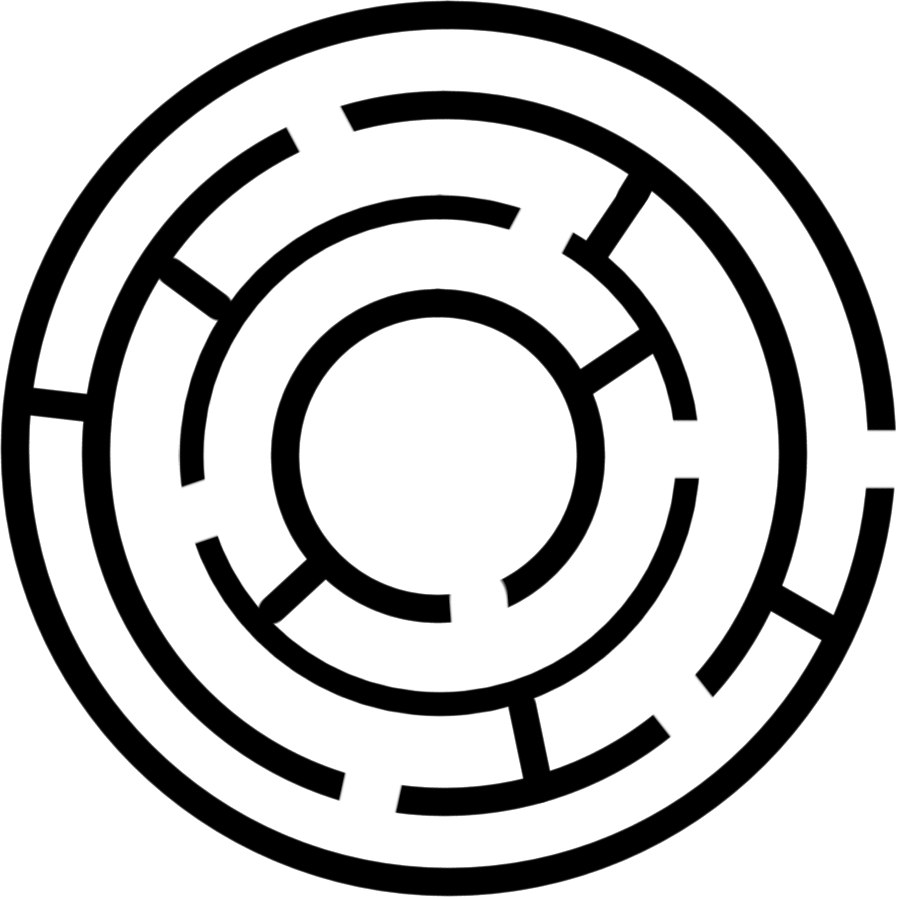
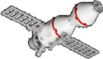
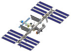
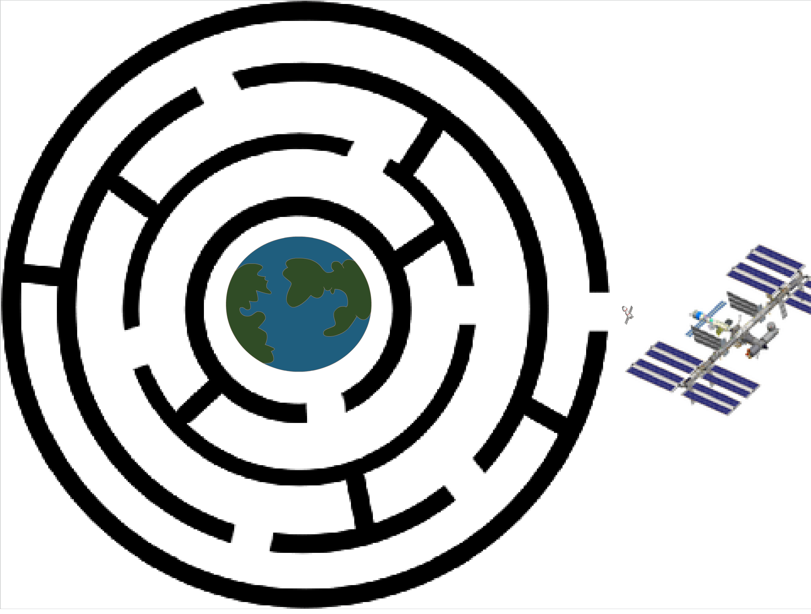

## Setting up your project

- First, you will need to open a new Scratch project.

[[[generic-scratch-new-project]]]

- Now you're going to need to set the backgound image of the Stage where you will create your maze. You can use the one shown below. Just right-click on the image and save it to your computer. Alternatively, you can get all the images you need for this project by downloading [this zip file](resources/assets.zip).

	

- Next you need to load the maze so you can use it as a backdrop.

[[[generic-scratch-backdrop-from-file]]]

- Now you can add in a few sprites. Two of them can come from the images below - they are the Soyuz capsule and the ISS. Again, you can right-click to download them.

   
   

- Once you have the sprites, you need to import them into you Scratch game.

[[[generic-scratch-add-sprite-from-file]]]

- The last sprite you need is a picture of the Earth. This is included in Scratch, so click on the icon **Choose a sprite from library**, and pick the Earth from the Space theme.

[[[generic-scratch-sprite-from-library]]]

- You'll now want to spend some time positioning your sprites on the stage. It should look like this:

	

- To resize your sprites, you can use the buttons looking like this:

	
