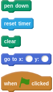
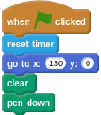

## The Soyuz leaves the ISS

- The pilot needs to navigate the Soyuz capsule through the maze of space junk and back to Earth, but they can't take too long. You can use a timer to see how long it takes them.

[[[generic-scratch-timer]]]

- Click on the Soyuz sprite and add the blocks you need to reset a timer when the flag is clicked.

- Next, you want to reset the position of the Soyuz capsule and also start making it draw using the pen tool, so it will leave a trail wherever it goes.

- Add a block to set the Soyuz sprite's position to `x:130` and `y:0`. You might need to adjust the `x` and `y` position depending on your maze.

[[[generic-scratch-set-coordinates]]]

- Next, clear the screen and set the pen down.

[[[generic-scratch-basic-pen]]]

- If you struggle with this, or just want to check you've done it correctly, you can use the hints below.

--- hints --- --- hint ---
Your script should look something like this:
```scratch
when flag clicked
reset timer
go to x:(130) y:(0)
clear
pen down
```
--- /hint --- --- hint ---
Here are all the blocks you will need:

--- /hint --- --- hint ---
Here's how the blocks go together:

--- /hint --- --- /hints ---
