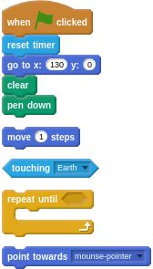
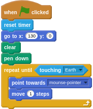

## Heading home

- The game needs to run until the Soyuz capsule reaches Earth, and the capsule should keep following the mouse position as the player guides it through the maze. Try and find the blocks you need to do the following:
  1. Keep looping until the capsule touches the Earth
  1. Point towards the mouse pointer
  1. Move 1 step

--- hints --- --- hint ---
The loop you will need is the `repeat until` loop. You can find a block to detect if the capsule is touching the Earth in the `Sensing` menu.
--- /hint --- --- hint ---
Here are all the blocks you need, but jumbled up:

--- /hint --- --- hint ---
Here's how to blocks all fit together as a complete script:

--- /hint --- --- /hints ---

- Now click on the green flag to have a play. The Soyuz capsule should follow your mouse pointer around the screen and draw as it goes.

--- collapse ---
---
title: How do you think you can make the capsule go faster or slower?
---
Answer: Change the number of steps it moves. Try 2 steps, or 0.5 steps.
--- /collapse ---
