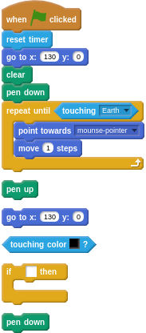
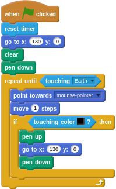

## Avoiding the junk

- Next, you need to make sure the game restarts if the Soyuz hits any space junk. Luckily the maze is all black, so it's quite easy to detect. You can use an `if __ then` conditional to detect if the maze has been hit.

- If the Soyuz capsule does hit the maze, then it needs to return to the ISS to start again, but it'll need to lift the pen up first, so it doesn't draw a line across the screen.

- Have a go at coding this, and use the hints if you get stuck.

--- hints --- --- hint ---
Here's some code written as text that you can work with:
```
if touching black then:
    pen up
	go to x:130, y:0
	pen down
```
--- /hint --- --- hint ---
Here's some jumbled code blocks. Can you arrange them to make your script work?

--- /hint --- --- hint ---
Here's the completed script you will need:

--- /hint --- --- /hints ---

- Click on the green flag and test your game. Make sure that your Soyuz sprite returns to the start if you hit the maze. Also make sure the spacecraft isn't moving too quickly, or is too big to fit through the gaps in the maze. You can make the Stage bigger in Scratch by clicking on this icon:

	
