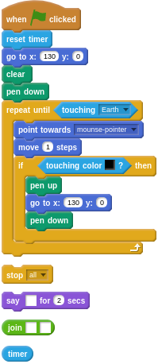
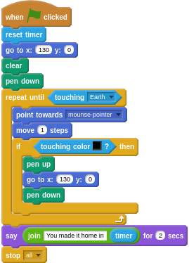

## Permission to land

- If the Soyuz reaches Earth, then the `repeat until` loop will end.

- To finish off, you can add a little message to the end of the loop telling the player how long it took them to land on Earth. You can also stop the script. Use a `join` block to combine what you want to say with the count on the `timer`.

--- hints --- --- hint ---
After the loop, you need to add some blocks that will do the following:
  1. Say the time on the timer
  1. Stop the script
--- /hint --- --- hint ---
Here's a jumble of blocks for you to sort out:

--- /hint --- --- hint ---
Here's the completed script:

--- /hint --- --- /hints ---

- Test and save your project. Did you make it back to Earth?
