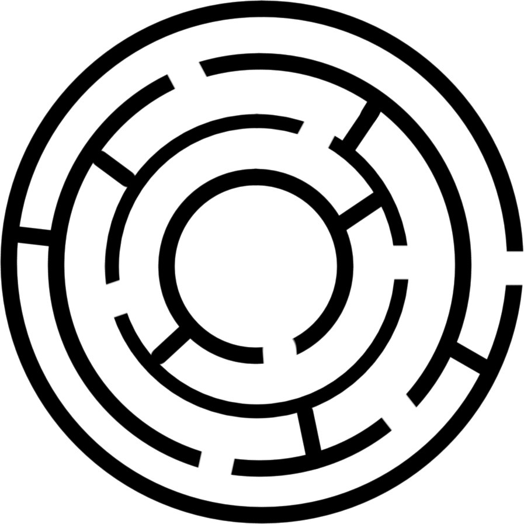
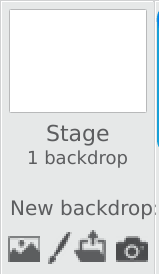
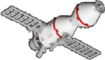
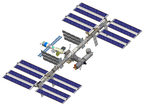
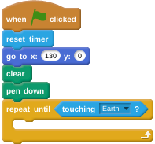
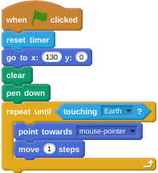

# Space Maze

There are over half a million pieces of space junk orbiting the Earth. Some of these travel at speeds of up to 175000 miles per hour. This makes it tricky to get a spacecraft from Earth to the International Space Station and back again.

In this activity, you're going to build a Space Maze where the pilot of a spacecraft has to carefully navigate their way back down from the ISS to Earth again.

On 15 December 2015, British ESA astronaut Tim Peake set off on the Principia mission to the International Space Station, which is in orbit around the Earth. This project ties in with the Principia Space Diary, a free resource for UK schools, which was produced as part of Tim Peake’s Principia Mission. For more information about the Space Diary, visit [principiaspacediary.org](http://principiaspacediary.org).

## Starting Scratch 2.0

1. Go to the [Scratch 2.0](https://scratch.mit.edu) website in your browser.

1. If you want to save your work, you'll either need to sign in (if you already have a Scratch account) or sign up.

   

1. Once that's completed, you can click on Create to start a new project.

   

## Setting the stage

1. Let's start by importing the maze we want to use. Right-click on the maze graphic below to save it to your computer.

   

1. Now click on the following icon:

	

	and click on the Upload symbol. You can then choose the [`basic_maze.png`](images/basic_maze.png) image you have downloaded.

1. Next, you can add in a few sprites. Two of them can come from the images below; these are the Soyuz capsule and the ISS. Again, you can right-click to download them.

   
   

1. Click on the Upload icon in the New Sprite menu:

	

	and upload the [`soyuz_sprite.png`](images/soyuz_sprite.png) and the [`iss_sprite.png`](images/iss_sprite.png) images.

1. The last sprite you need is a picture of the Earth. This is included in Scratch, so click on the icon to 'choose a sprite from library', and pick the Earth from the Space theme.

	

1. You'll now want to spend some time positioning your sprites on the stage. It should look like this:

	

1. To resize your sprites you can use the following buttons:

## The Soyuz leaves the ISS

1. The pilot needs to navigate the Soyuz capsule through the maze of space junk and back to Earth, but they can't take too long. You can use a timer to see how long it takes them.

1. Click on the Soyuz sprite so that you can start adding scripts. The first should just reset the game's timer.

	

1. Next, you want to reset the position of the Soyuz capsule and also start making it draw using the pen tool. This will leave a trail wherever it goes.

   	

## Heading home

1. The game needs to continue until the Soyuz capsule reaches Earth. A `repeat until` loop is perfect for this. You can find `touching Earth` in the Sensing menu.

	

1. Now the Soyuz capsule needs to move. You can make it point towards your mouse pointer and move a single step.

   

1. Now click on the green flag to have a play. The Soyuz capsule should follow your mouse pointer around the screen and draw as it goes. How do you think you can make it go faster or slower?

## Avoiding the junk

1. Next, you need to make sure the game restarts if the Soyuz hits any space junk. Luckily the maze is all black, so it's quite easy to detect. You can use an `if __ then` conditional to detect if the maze has been hit.

   

1. If the Soyuz capsule does hit the maze, then it needs to return to the ISS to start again, but it'll need to lift the pen up first, so it doesn't draw a line across the screen.

	

1. Click on the green flag and test your game. Make sure that it returns to the start if you hit the maze. Also make sure the spacecraft isn't moving too quickly or is too big to fit through the gaps in the maze. You can make the stage bigger in Scratch by clicking on the following icon:

## Permission to land

1. If the Soyuz reaches Earth, then the `repeat until` loop will end. So to finish off, you can add a little message to the end of the loop, telling the player how long it took them to land. You can also stop the script. Use a `join` block to combine what you want to say with the count on the timer.

	

1. Then you can place this into a `say` block and `stop all` scripts.

	

## What next?

- Why not try making the game a little easier or more difficult by changing the speed of the Soyuz capsule?
- Perhaps you could add some satellites to the game that move around in a circle and also need avoiding, like in [this example](https://scratch.mit.edu/projects/138408971).
